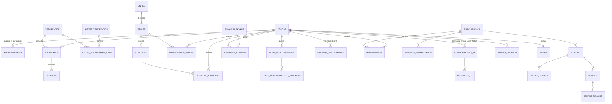

# Livrable 3 : schéma de base de données

> PostgreSQL (Supabase). Script complet : [schema.sql](schema.sql). Statut : **à valider**.
> Vérifié dans un Postgres en mémoire (PGlite) : le script se charge sans erreur. L'algorithme SM-2, l'accès premium, les contraintes de variante et d'abonnement, ainsi que les 25 règles d'accès (RLS) ont été testés.

## Vue d'ensemble

## Tables par domaine

| Domaine | Tables | Points clés |
|---|---|---|
| **Utilisateurs** | `profils`, `apprentissages`, `erreurs_recurrentes`, `consentements` | Une ligne `apprentissages` par langue apprise, avec sa **variante** (une contrainte interdit par exemple portugais + UK), son niveau par compétence (données du radar), son objectif et son examen visé. `erreurs_recurrentes` alimente la mémoire du professeur IA. |
| **Contenu** | `unites`, `etapes`, `exercices`, `medias` | Unité (langue, niveau, thème, tâche finale) → 8 étapes (`decouverte` … `bilan`) → exercices (18 types). Le contenu d'une étape est en JSON, décliné par variante. Les exercices portent des paramètres IRT pour le test adaptatif et un rattachement facultatif à une partie d'examen. |
| **Vocabulaire** | `vocabulaire`, `listes_vocabulaire`, `listes_vocabulaire_items` | Des expressions plutôt que des mots isolés, avec genre (ES/PT), API, audio et lien vers l'équivalent dans l'autre variante (*front desk* ↔ *reception*). Listes thématiques, TOEIC, faux amis, argot. |
| **Révision espacée** | `flashcards`, `revisions`, fonction `reviser_flashcard()` | SM-2 côté base : facilité, intervalle, répétitions, prochaine révision. Test : notes 5, 4, 4 → intervalles de 1, 6 et 16 jours, puis un échec (note 1) → retour à 1 jour. |
| **Positionnement** | `tests_positionnement`, `tests_positionnement_reponses` | Le test peut commencer sans compte (`jeton_anonyme`) et être rattaché après l'inscription. Il donne un niveau CECRL par compétence, un TOEIC estimé, un DELE visé et un CELPE-Bras estimé. |
| **Résultats** | `progression_etapes`, `resultats_exercices`, `productions_ecrites`, `productions_orales` | Productions corrigées par l'IA, avec notes par critère (grille CECRL, DELE, IELTS ou CELPE-Bras) et score de prononciation mot par mot. |
| **Examens** | `examens_blancs`, `passages_examens` | Structure des épreuves en JSON. `officiel` est forcé à `false` par une contrainte. |
| **Professeur IA** | `conversations_ia`, `messages_ia`, `usage_quotidien` | On stocke le JSON du professeur tel quel (corrections, bilan). `usage_quotidien` sert aux limites de l'offre gratuite (5 messages, 10 exercices par jour). |
| **Gamification** | `series`, `evenements_xp`, `badges`, `badges_obtenus`, `defis`, `participations_defis`, `certificats` | Classements facultatifs (`visible_classement`). Chaque certificat a un code de vérification. |
| **B2B** | `organisations`, `membres_organisation`, `classes`, `eleves_classes`, `devoirs`, `rendus_devoirs` | Rôles admin, professeur, RH et élève. Le service de chaque membre alimente le tableau de bord RH. |
| **Paiement** | `abonnements`, `evenements_stripe`, fonction `est_premium()` | Un abonnement est rattaché soit à une personne, soit à une organisation, jamais aux deux. Les webhooks Stripe sont idempotents. |

## Sécurité et RGPD

- **RLS activée sur toutes les données personnelles** : chaque élève ne voit que ses lignes. Un professeur voit la progression et les résultats des élèves de ses classes.
- **Contenu premium** : les étapes d'une unité non gratuite ne sont lisibles que si `est_premium()` est vrai.
- **Réponses des exercices** : les colonnes `reponse` et `explication` ne sont pas accessibles depuis le navigateur. La correction passe par le serveur, sinon il suffirait d'ouvrir les outils de développement pour tricher.
- **Effacement** : supprimer le compte (`auth.users`) supprime en cascade toutes les données personnelles.
- **Enregistrements vocaux** : stockage privé, purgé après 90 jours. Un consentement spécifique est demandé (`enregistrement_voix`).

## Installation (Supabase)

1. Créer un projet Supabase (région UE, pour le RGPD).
2. Ouvrir SQL Editor, coller [schema.sql](schema.sql) et l'exécuter.
3. Brancher le professeur IA pour qu'il enregistre `conversations_ia` et `messages_ia`. Cela se fera dans la version MVP (Next.js), voir le livrable 7.
